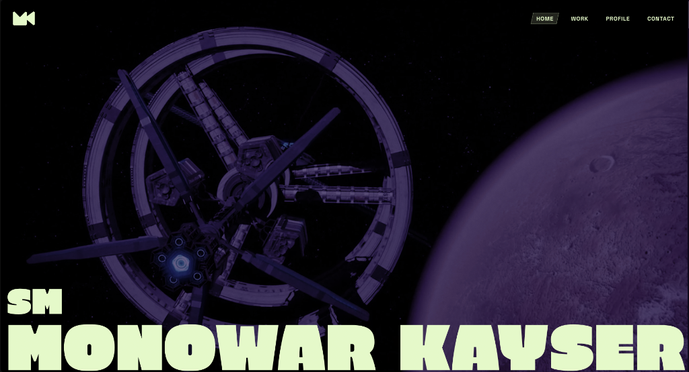

# monowarkayser.com



Portfolio website for **S M Monowar Kayser** — a multimedia designer, 3D artist, and lecturer at Daffodil International University. Built as a fully custom, space-themed interactive experience from scratch. No templates, no page builders.

**[→ Live Site](https://monowarkayser.com)**

---

## About the project

MK needed a portfolio that actually reflects what he does — immersive 3D work, cinematic motion, creative storytelling. So instead of going the safe route with a Squarespace or WordPress theme, I built this from the ground up.

The site features an interactive 3D rover scene (Perseverance, Draco-compressed and texture-stripped for speed), horizontal scroll transitions, particle systems, a canvas-rendered timeline, and a few other things that felt right for someone in his field. The whole thing runs smooth on desktop and gracefully degrades on mobile — no 3D on phones, just clean layouts and swipeable carousels.

## Running locally

```bash
npm install
npm run dev
```

Opens at `localhost:5173`. Vite handles the rest.

For a production build:

```bash
npm run build
npm run preview
```

## How it's built

The stack is intentionally lean — no React, no Next.js, no framework overhead. Just modules.

- **Vite** for bundling and dev server
- **Three.js** for the 3D scenes (rover viewport, expertise sphere, award particles)
- **GSAP + ScrollTrigger** for all the scroll-driven animations and transitions
- **Lenis** for that buttery smooth scroll feel
- **Tailwind CSS** for styling
- **Vanilla JS (ES6 modules)** for everything else

Heavy stuff like the rover scene, teaching sphere, and particle systems are code-split into separate chunks and lazy-loaded where it makes sense. The rover model itself is a Draco-compressed GLTF with embedded textures stripped out (materials are applied in code anyway), bringing it down from ~7.5MB to ~1.3MB.

## Project layout

```
src/
├── main.js                  # entry point, orchestrates everything
├── rover-scene.js           # Three.js perseverance rover viewport
├── spotlight-interaction.js # rover UI overlay (mode switching, HUD)
├── teaching-areas.js        # 3D expertise tag sphere
├── tree-timeline.js         # canvas-based journey timeline
├── awards-particles.js      # floating particles on awards section
├── scroll-animations.js     # GSAP scroll-driven transitions
├── performance-manager.js   # adapts quality based on device capability
├── data.js                  # content data (journey, expertise tags)
├── style.css                # base styles + tailwind
└── ...                      # cursor effects, nav, tilt, etc.

public/
├── models/perseverance/     # draco-compressed rover model
├── draco/                   # WASM decoder for draco
├── images/                  # project thumbnails, profile photo
└── ...                      # manifest, sitemap, robots.txt
```

## Deployment

Hosted on **Netlify**. The `netlify.toml` in the root handles build config, redirects, caching headers, and security headers automatically. Push to `main` and it's live.

There's also a GitHub Actions workflow if you ever want to switch to GitHub Pages.

## Notes

- Needs **Node 20+** to build
- Rover model uses Draco compression — WASM decoder lives in `public/draco/`
- PWA-ready with auto-updating service worker
- On mobile, 3D scenes are skipped entirely to keep things fast

---

Designed & developed by **[Munasib Apurbo](https://github.com/MunasibApurbo)**
